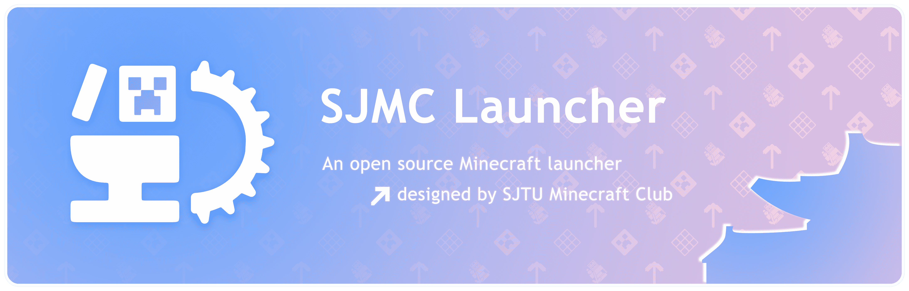

<div align="center">



# BGUMCL

面向中国大陆网络环境优化的 Minecraft: Java Edition 便携启动器。

[](https://github.com/Muzimi-ciallo/BGUMCL/releases/latest)
[](#运行要求)
[](#下载与使用)
[](LICENSE)

[下载最新版](https://github.com/Muzimi-ciallo/BGUMCL/releases/latest) · [提交问题](https://github.com/Muzimi-ciallo/BGUMCL/issues/new/choose) · [更新日志](docs/CHANGELOG.zh-Hans.md)

</div>

> [!IMPORTANT]
> BGUMCL 目前只发布 **Windows 10/11 x86_64 便携版**，不提供安装器、macOS 或 Linux 客户端。项目仍在持续开发，请在导入、迁移或删除实例前备份重要存档。

BGUMCL 是一款基于 [SJMCL](https://github.com/UNIkeEN/SJMCL) 二次开发的开源 Minecraft 启动器。项目保留 SJMCL 的实例管理、资源发现、账户和扩展能力，并重点改善中国大陆网络下导入整合包后下载模组、Forge 运行库及 Minecraft 资源时的速度与稳定性。

## 下载与使用

前往 [GitHub Releases](https://github.com/Muzimi-ciallo/BGUMCL/releases/latest)，下载名称类似下面格式的文件：

```text
BGUMCL_1.4.0_windows_x86_64_portable.exe
```

当前正式版为 **1.4.0**。这是完整便携版，无需安装。

1. 新建一个可读写的独立目录，例如 `D:\Games\BGUMCL`。
2. 将下载的便携版放入该目录，不要直接在压缩包、临时目录或系统保护目录中运行。
3. 双击启动 BGUMCL，根据引导添加账户并检查 Java。
4. 创建新实例，或者导入已有整合包。

便携模式会在程序所在目录保存 `bgumcl.conf.json`，并默认使用同目录下的 `.minecraft` 作为游戏目录。移动启动器时，建议将这些文件一起移动。

> [!TIP]
> 如果 Windows 显示来源提示，请先确认文件来自本仓库的正式 Release，并核对 Release 页面提供的 SHA-256 摘要。不要运行从不明群聊、网盘或第三方网站获得的副本。

## 运行要求

| 项目       | 当前支持范围                                     |
| ---------- | ------------------------------------------------ |
| 操作系统   | Windows 10、Windows 11                           |
| 处理器架构 | x86_64（64 位）                                  |
| 分发方式   | 单文件便携版                                     |
| Minecraft  | Java Edition                                     |
| 模组加载器 | Fabric、Forge、NeoForge、Quilt、OptiFine         |
| 整合包     | Modrinth、CurseForge、MultiMC 及湾大服务器分发包 |
| 在线资源   | CurseForge、Modrinth 与 Minecraft 官方资源       |

启动器依赖 Microsoft Edge WebView2 Runtime；Windows 10/11 通常已预装。Minecraft 使用的 Java 可由启动器扫描或按游戏版本配置。

## 核心功能

- **实例集中管理**：管理多个游戏目录和实例，以及对应的模组、资源包、光影包、存档、截图与启动设置。
- **资源发现与安装**：浏览并下载 CurseForge、Modrinth 上的模组、整合包及其他游戏资源。
- **整合包导入与导出**：支持 Modrinth `.mrpack`、CurseForge、MultiMC 等格式，并提供湾大服务器整合包一键下载入口。
- **加载器管理**：安装或更新 Fabric、Forge、NeoForge、Quilt 和 OptiFine。
- **多账户支持**：支持 Microsoft、离线账户及兼容 Yggdrasil 的第三方认证服务。
- **启动器更新**：从正式发布源检查并下载新版，网络异常时自动尝试备用地址。
- **扩展与自动化**：支持扩展、深度链接、CLI 和仅监听本机回环地址的 MCP 服务。

## 中国大陆下载优化

1.4.0 引入 Download Engine V2，让整合包、模组、加载器运行库和 Minecraft 文件共享同一套下载调度逻辑。

- 为每个文件保留当前表现最好的候选源，连接失败、超时或持续低速时再切换。
- 根据任务规模和网络反馈动态调整并发，不使用固定并发一口气压满连接。
- 对较大的文件使用受控分段下载，并在服务器 Range 响应异常时安全回退。
- 将不同来源的文件交错调度，减少任务后半段只剩少量慢源文件的情况。
- 对失败候选设置冷却并继续尝试其他地址，避免整个任务长期卡在单个资源。
- 降低进度事件和任务持久化频率，并在取消导入时清理未完成任务与残留实例。

不同省份、运营商、时段和上游 CDN 的实际状况仍会影响速度。下载引擎会尽量自动恢复，但无法保证任何网络下都达到相同速率。

## 常见问题

### 为什么会看到 localhost 或 127.0.0.1？

启动器界面已经打包在本地程序中，不需要连接远程网页才能显示。BGUMCL 会在 `127.0.0.1` 上启动本地认证和 MCP 服务，用于启动游戏及本机自动化；这些端口只监听本机回环地址。

如果出现“localhost 拒绝连接”，请先确认只运行了一个 BGUMCL 进程，并检查安全软件是否阻止了程序访问本机回环网络。

### 下载最后几个文件时失败或变慢怎么办？

1. 保留任务并点击重试，让下载器继续尝试剩余文件和备用源。
2. 暂时关闭可能不稳定的代理或 VPN，再进行一次对照测试。
3. 确认系统时间正确，并检查防火墙或安全软件是否拦截 CurseForge、Modrinth 或 Minecraft CDN。
4. 若同一文件持续失败，请附上日志提交 Issue，不要只提供“下载失败”的截图。

### 启动器日志在哪里？

Windows 日志目录为：

```text
%LOCALAPPDATA%\BGUMCL\logs\launcher\
```

日志文件名形如 `launcher_log_1787510279.log`。公开上传前建议检查其中是否包含你不希望公开的本地路径或账户信息。

### 自动更新卡住怎么办？

完全退出 BGUMCL，然后从 [最新 Release](https://github.com/Muzimi-ciallo/BGUMCL/releases/latest) 手动下载便携版并替换旧的 `.exe`。不要删除同目录下的 `bgumcl.conf.json` 和 `.minecraft`，除非你确定不再需要其中的数据。

### 取消导入后仍有残留实例怎么办？

先在下载页面确认相关任务已经取消，再从实例列表删除未完成实例。不要在任务仍运行时直接删除实例目录；如果取消后的任务再次自动出现，请保留现场并提交日志。

## 反馈问题

请通过 [GitHub Issues](https://github.com/Muzimi-ciallo/BGUMCL/issues/new/choose) 反馈。下载问题至少需要包含：

- BGUMCL 版本号；
- Windows 版本；
- 所在省份和网络运营商；
- 是否使用代理或 VPN；
- 可复现的操作步骤；
- 错误截图；
- 对应的 `launcher_log_*.log`。

安全问题请按照 [SECURITY.md](SECURITY.md) 中的方式报告，不要在公开 Issue 中披露敏感漏洞或凭据。

## 本地开发

开发环境需要 Node.js 22 或更高版本、pnpm、Rust 1.91，以及 Tauri v2 在 Windows 上所需的构建组件。

```powershell
git clone https://github.com/Muzimi-ciallo/BGUMCL.git
Set-Location BGUMCL
pnpm install
Copy-Item .env.template .env
pnpm tauri dev
```

如需在本地使用 CurseForge 功能，请在 `.env` 中配置自己的 `BGUMCL_CURSEFORGE_API_KEY`。这些环境变量会在编译时写入后端，请勿提交 `.env` 或真实密钥。

常用检查命令：

```powershell
pnpm build
pnpm eslint "src/**/*.{js,jsx,ts,tsx}" --no-fix --max-warnings=0
cargo fmt --manifest-path src-tauri/Cargo.toml -- --check
cargo test --manifest-path src-tauri/Cargo.toml --lib
```

构建 Windows 便携版：

```powershell
pnpm tauri build --no-bundle
python scripts/release/bundle_portable_assets.py `
  -p src-tauri/target/release `
  -o BGUMCL_1.4.0_windows_x86_64_portable.exe `
  BGUMCL.exe
```

封装后的文件位于 `src-tauri/target/release/`。提交代码前请阅读 [CONTRIBUTING.md](CONTRIBUTING.md) 和 [行为准则](docs/CODE_OF_CONDUCT.zh-Hans.md)。

## 项目状态

- 当前发布通道仅维护 Windows x86_64 便携版。
- CurseForge、Modrinth、GitHub、Gitee 和 Minecraft CDN 均属于外部服务，其可用性不由 BGUMCL 控制。
- 新下载引擎已通过本地自动化测试，但仍需要不同省份和运营商环境的持续反馈。
- 建议始终备份重要存档、服务器地址、截图和自定义配置。

## 致谢与许可证

BGUMCL **基于 [SJMCL](https://github.com/UNIkeEN/SJMCL) 修改而来**，并非 SJMCL 官方发行版。感谢 SJMCL 项目及其所有[贡献者](https://github.com/UNIkeEN/SJMCL/graphs/contributors)提供的开源基础与启发。

同时感谢 DSV4-Pro 在项目修改和调试过程中的协助，以及“蓝色吃白饭大肥鱼”提供的协作与支持。

本项目依据 [GNU General Public License v3.0](LICENSE) 及其[附加条款](LICENSE.EXTRA)发布。分发修改版本时，请同时遵守两份许可文件中的要求。
