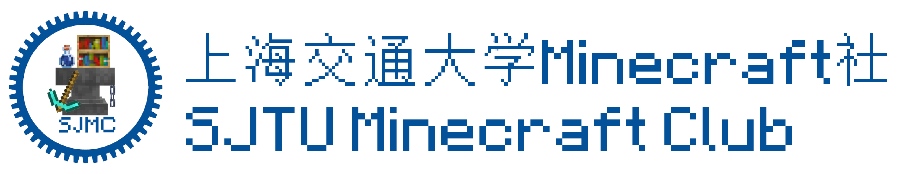
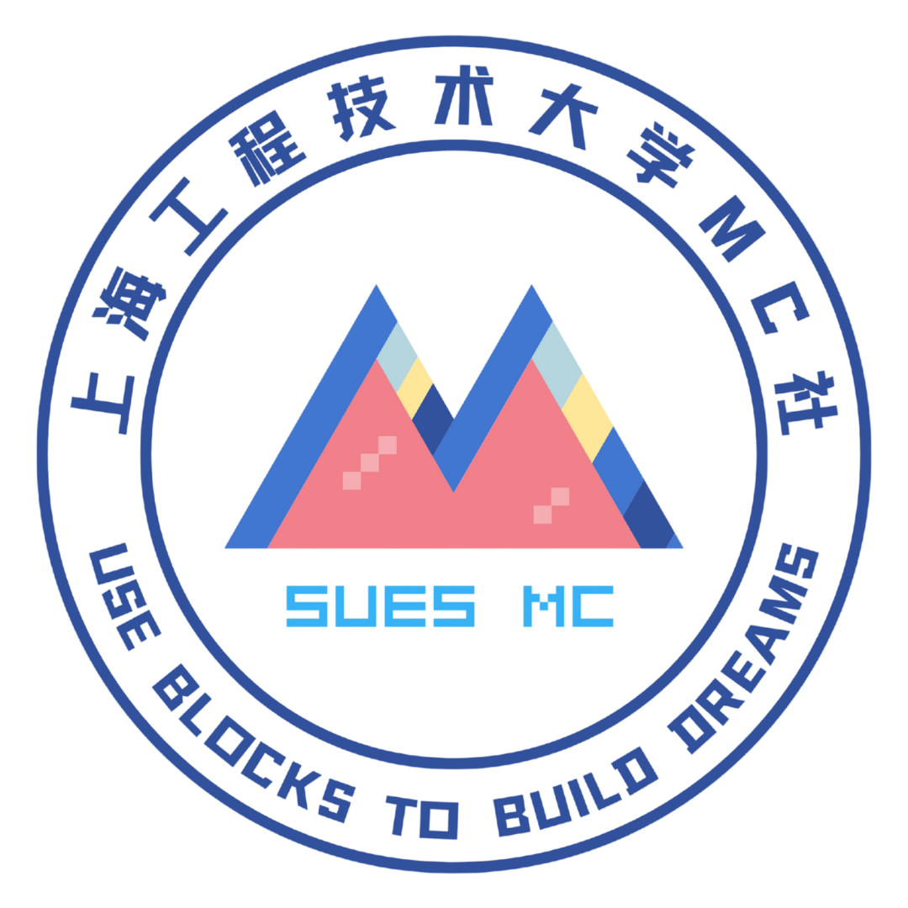
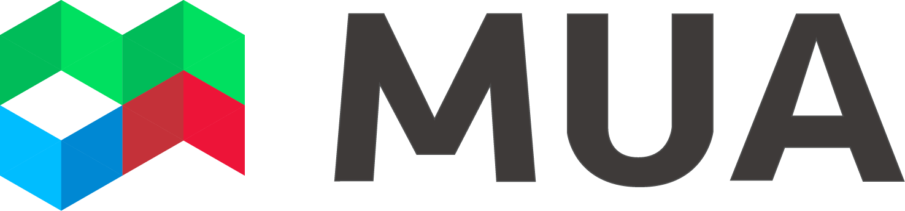
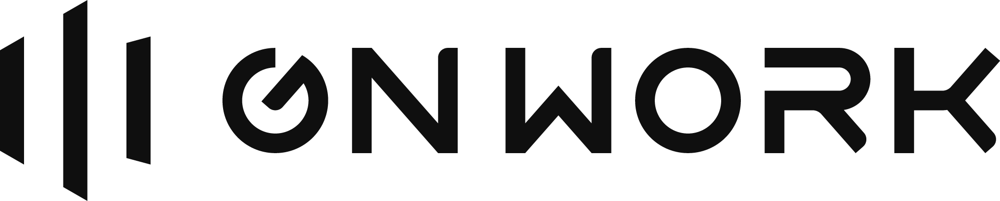

[English](../README.md) · **简体中文** · [繁體中文](README.zh-Hant.md)

## 功能特性

* **跨平台支持**：兼容 Windows 10/11、macOS 与 Linux。
* **高效的实例管理**：支持多个游戏目录与实例，集中管理所有实例资源（如存档、模组、资源包、光影包、截图等）与设置。
* **便捷的资源下载**：支持从 CurseForge 与 Modrinth 等源下载游戏客户端、模组加载器、各类游戏资源与整合包。
* **多账户系统支持**：内置 Microsoft 登录与第三方认证服务器支持，兼容 Yggdrasil Connect 的 OAuth 登录流程规范提案。
* **外部服务协同**：通过深度链接与 MCP 服务，与外部网页、程序及 Agent 服务协同工作，提供一系列便捷功能与自动化能力。
* **开放扩展系统**：支持开发扩展，为启动器扩展更多有趣且实用的功能。
* **增量更新系统**: 增加了通过github仓库进行增量更新的功能。
  
> 注意：目前仍处于开发修改阶段。

## 感谢

衷心感谢以下组织对 BGUMCL 项目开发与社区的支持。

再次感谢SJMC的开源项目与启发！！！

[
  <picture>
    <source srcset="figs/partners/sjmc-dark.png" media="(prefers-color-scheme: dark)">
    <source srcset="figs/partners/sjmc.png" media="(prefers-color-scheme: light)">
    
  </picture>
](https://mc.sjtu.cn)
&nbsp;&nbsp;

[
  <picture>
    <source srcset="figs/partners/mua-dark.png" media="(prefers-color-scheme: dark)">
    <source srcset="figs/partners/mua.png" media="(prefers-color-scheme: light)">
    
  </picture>
](https://www.mualliance.cn)
&nbsp;&nbsp;&nbsp;&nbsp;
[
  <picture>
    <source srcset="figs/partners/gnwork-dark.png" media="(prefers-color-scheme: dark)">
    <source srcset="figs/partners/gnwork.png" media="(prefers-color-scheme: light)">
    
  </picture>
](https://space.bilibili.com/403097853)
